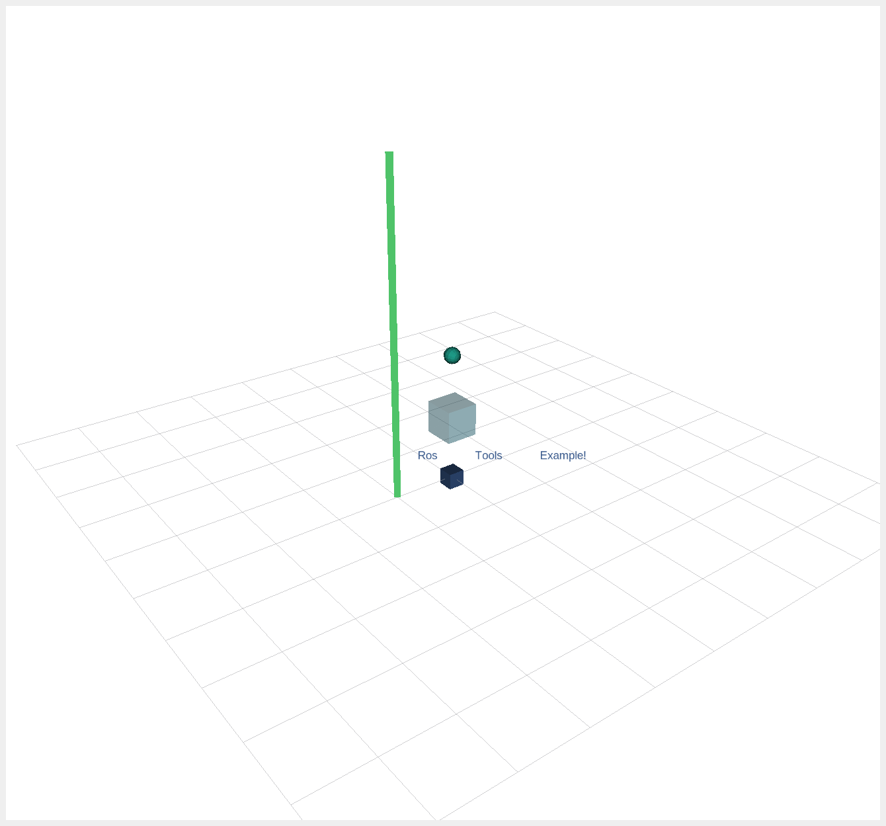

[](https://github.com/oscardegroot/ros_tools/actions/workflows/ros1.yml)
[](https://github.com/oscardegroot/ros_tools/actions/workflows/ros2.yml)

# ROS Tools
This package is a tool package for C++ ROS/ROS2 that standardizes and simplifies basic features over ROS/ROS2.




## Table of Contents
1. [Features](#features) 
2. [Installation](#installation) 
3. [Examples](#examples) 
4. [License](#license) 


## Features
This package is a tool package for ROS/ROS2 that contains:
- Tools for visualization in RViz `ros_visuals.cpp`

- Tools for data saving `data_saver.h`

- Tools for profiling in `profiling.h`

- Tools for logging in `logging.h`

- Various other tools

## Installation
Clone this repository

```
git clone https://github.com/oscardegroot/ros_tools.git
```

Install dependencies with

```
rosdep install --from-paths src --ignore-src -r -y
```

To define its ROS version, run `python3 switch_to_ros.py <ROS_VERSION>`, with `ROS_VERSION` either `1` or `2`.

Note that a rough python version of the visuals is also provided under `scripts`, but is not actively maintained.

---
## Examples

A ROS1 example is provided in `src/example.cpp`. Run the example with `ros launch ros1_example.launch`.

You should see the following in `rviz`:


### Visualization
The visualization wrappers for RViz are provided in `ros_tools/visuals.h`. For example, the following code draws a cube at the origin on the topic `ros_tools/example`:

```cpp
        auto &publisher = VISUALS.getPublisher("ros_tools/example");
        auto &cube = publisher.getNewPointMarker("CUBE");
        cube.setColorInt(0, 5);                           
        cube.setScale(0.25, 0.25, 0.25);                 
        cube.addPointMarker(Eigen::Vector3d(0., 0., 0.)); 
        publisher.publish()
```

---

### Debugging
This package provides useful commands for logging/debugging.

- `ROSTOOLS_HOOK` prints the line and file where it is in the terminal and can be clicked in `VSCode`. 
- `ROSTOOLS_ASSERT` prints its line and file when the assert fails.
- `LOG_INFO`, `LOG_WARN`, `LOG_ERROR`, `LOG_SUCCESS` logs info messages

### Profiling
Profiling output is stored in the package that is selected in its initialization (see the example). To view the output, open chrome and go to `chrome://tracing/`. Click load in the top left and navigate and select `<your_package>/profiler.json`.

The output of the example is the following:


---

### Data Saving
Data is saved in `ros_tools/scripts/data/example_data.txt`. See the example for more details.

---

## License
This project is licensed under the Apache 2.0 license - see the LICENSE file for details.
