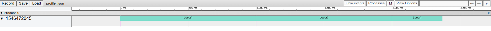

[](https://github.com/oscardegroot/ros_tools/actions/workflows/ros1.yml)
[](https://github.com/oscardegroot/ros_tools/actions/workflows/ros2.yml)

# ROS Tools
This package is a tool package for ROS/ROS2 that standardizes and simplifies basic features over ROS/ROS2.

## Table of Contents
1. [Features](#features) 
2. [Installation](#installation) 
3. [Examples](#examples) 
4. [License](#license) 


## Features
This package is a tool package for ROS/ROS2 that contains:
- Tools for visualization in RViz `ros_visuals.cpp`

- Tools for data saving `data_saver.h`

- Tools for profiling in `profiling.h`

- Tools for logging in `logging.h`

- Various other tools

## Installation
Clone this repository

```
git clone https://github.com/oscardegroot/ros_tools.git
```

Install dependencies with

```
rosdep install --from-paths src --ignore-src -r -y
```

To define its ROS version, run `python3 switch_to_ros.py <ROS_VERSION>`, with `ROS_VERSION` either `1` or `2`.

<!-- For usage with cpp see the [cpp-example](src/example.cpp). To launch the cpp example use

```
ros2 launch ros_tools example.launch
```

For usage with python see the [python-example](ros_tools/example_py.py). To launch the cpp example use

```
ros2 launch ros_tools example_py.launch.py
``` -->

---
## Examples

### Visualization
We provide wrappers for visualization that simplifies drawing markers in rviz. For example, to draw a cube the following code is sufficient.

```cpp
auto& cube = marker_publisher.getNewPointMarker("CUBE");
cube.setColorInt(0, 5); // Color by index
cube.setScale(0.25, 0.25, 0.25); // Scale in all directions
cube.addPointMarker(Eigen::Vector3d(0., 0., 0.)); // Cube position
```

When running the example, you should see the following in `rviz`/`rviz2`:


---

### Debugging
This package provides useful commands for logging/debugging.

- `ROSTOOLS_HOOK` prints the line and file where it is in the terminal and can be clicked in `VSCode`. 
- `ROSTOOLS_ASSERT` prints its line and file when the assert fails.
- `LOG_INFO` logs info messages


### Profiling
Profiling output is stored in the package that is selected in its initialization (see the example). To view the output, open chrome and go to `chrome://tracing/`. Click load in the top left and navigate and select `<your_package>/profiler.json`.

The output should be as follows:



---

### Data Saving
Data is saved in `ros_tools/scripts/data/example_data.txt`. See the example for more details.

---

## License
